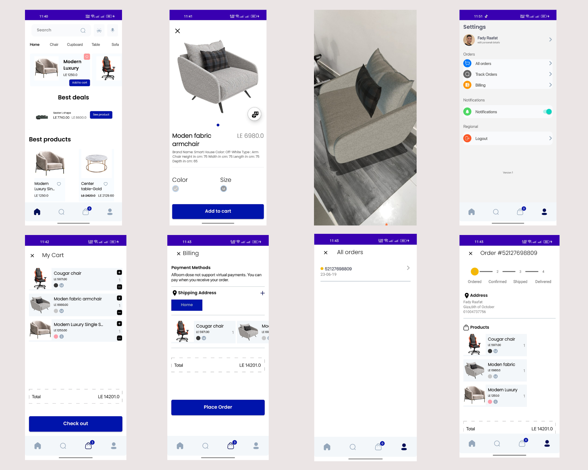

# ARoom

ARoom is a modern furniture e-commerce application that brings shopping into your physical space using Augmented Reality. Buying furniture online can be a challenge because it is hard to tell if a piece will fit or look right in your room. ARoom solves this by allowing you to virtually place 3D models of furniture in your actual environment before you make a purchase.

### The Design
The visual experience was a top priority for this project. I focused on creating a clean and intuitive interface that keeps the spotlight on the products. You can find the design assets in the project's design folder, where I have included **Design.png** to showcase the layout and aesthetic of the application.

### Technologies and Tools
I used a variety of modern Android development tools to ensure the app is fast, reliable, and easy to maintain.

* **SceneForm**: This is the heart of the AR experience. It uses Google ARCore and the Filament engine to render high-quality 3D models in real time.
* **Dagger Hilt**: I implemented Hilt for dependency injection. This keeps the code modular and makes it much easier to manage different components of the app.
* **Kotlin Coroutines**: All heavy tasks, especially Firebase network requests, are handled in the background to keep the user interface smooth and responsive.
* **MVVM and StateFlow**: This architecture helps separate the business logic from the views. StateFlow ensures that the app state is preserved during configuration changes like screen rotations.
* **Navigation Component**: I built the app using a Single Activity Architecture. This means one activity contains multiple fragments, which provides a smoother transition between screens.
* **Firebase Suite**: 
    * **Firebase Auth**: Manages secure user accounts, logins, and registrations.
    * **Firebase Firestore**: Acts as the main database for storing product details and user information.
    * **Firebase Storage**: Used to store product images, user profile pictures, and the 3D models themselves.
* **View Binding**: This replaces traditional view inflation, making the code safer and reducing boilerplate.
* **Glide**: This library handles image loading and caching to ensure a seamless browsing experience.
* **Custom UI Components**: I integrated specialized libraries like **LoadingButton** for interactive feedback, **CircleImageView** for profile photos, and **StepView** to track the checkout process.

### How I Built It
Building ARoom was a journey of connecting real-world interaction with digital commerce. The process started with designing the database structure in Firebase to handle a diverse catalog of furniture. 

The most technical part was the AR integration. I spent time ensuring that 3D models scaled correctly and interacted naturally with the environment using Sceneform. I followed the MVVM pattern strictly to keep the codebase organized and used Hilt to provide dependencies across the various layers of the app.

The navigation flow was designed to be as natural as possible. From browsing categories to the final checkout, every step is connected through the Navigation Component, allowing for a logical and fluid user experience. Every feature was built with a focus on bridging the gap between a digital catalog and the physical home.
